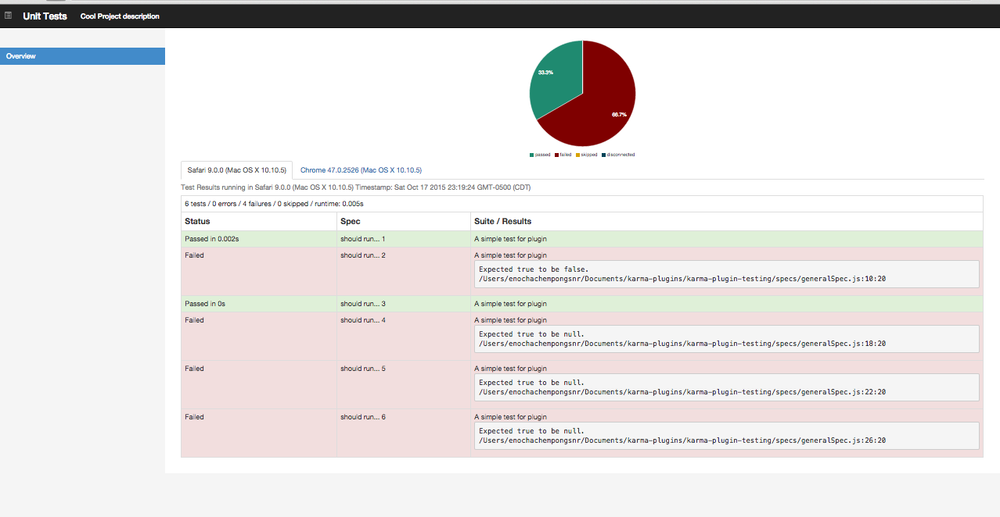

karma-htmlfilealt-reporter
=======================

## A karma plugin for exporting unit test results as styled HTML file using bootstrap css framework

This is a plugin for the [Karma Test Runner] which uses bootstrap css framework to generate the report. By adding this reporter to your karma configuration, unit test results will be exported as a styled HTML file. For each test browser, a separate table is generated which is grouped into a tab pane, this allows you to have lots of tests executed and grouped according to the browsers the results represent. Also it saves you having to scroll a lengthy page to find the browser's test result. In addition to this, the report provides a simple pie chart using c3.js. The plugin is  based on the [karma-htmlfile-reporter plugin].


### karma-htmlfile-reporter sample view


### karma-htmlfileAlt-reporter sample view


## Installation

The easiest way is to keep `karma-htmlfileAlt-reporter` as a devDependency in your `package.json`.
```json
{
  "devDependencies": {
    "karma": "~0.10",
    "karma-htmlfilealt-reporter": "~0.1"
  }
}
```

You can simple do it by:
```bash
npm install karma-htmlfilealt-reporter --save-dev
```

## Configuration
```js
// karma.conf.js
module.exports = function(config) {
  config.set({
    reporters: ['progress', 'htmlalt'],

    htmlReporter: {
      outputFile: 'tests/units.html',
			
      // Optional
      pageTitle: 'Unit Tests',
      subPageTitle: 'A sample project description'
    }
  });
};
```

You can pass list of reporters as a CLI argument too:
```bash
karma start --reporters htmlalt
```

Acknowledgement
================
This work was based on previous work by mathias schuetz

This is a beta version. I will be working on adding more features ...

----

For more information on Karma see the [homepage].

[Karma Test Runner]: https://github.com/karma-runner/karma
[karma-junit-reporter plugin]: https://github.com/karma-runner/karma-junit-reporter
[homepage]: http://karma-runner.github.com
